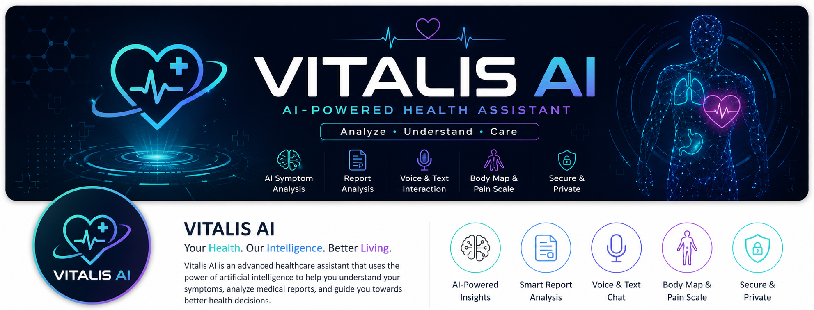
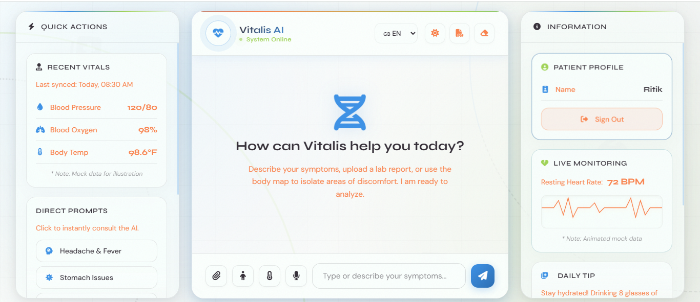

<div align="center">

  

  # 🧬 Vitalis AI

  **An intelligent, futuristic healthcare assistant powered by advanced AI and Puter.js**

  [](https://puter.com/)
  
  

</div>

<br />

Vitalis AI is a clinical-grade, modern healthcare chatbot designed to help users analyze symptoms, interact with medical reports, and receive immediate, AI-driven health insights. Built with a premium glassmorphism UI and powered entirely by [Puter.js](https://docs.puter.com/), it offers a seamless, serverless, and highly secure experience.

🚀 **Live Demo:** https://saurav444-ctrl.github.io/Ai-Vitalis/

---

## 📸 Dashboard Preview



---

## ✨ Core Features

- 🔐 **Secure Authentication** — Passwordless sign-in and user profile management via Puter.js.
- 🤖 **AI Symptom Checker** — Intelligent preliminary medical analysis using Puter's native AI integration.
- 🧍 **Interactive Body Map** — Pinpoint exactly where it hurts using a clickable SVG human anatomy map.
- 🌡️ **Dynamic Pain Scale** — Log symptom severity with a visual 1–10 slider featuring animated emoji feedback.
- 💬 **Smart Suggestion Chips** — Context-aware follow-up questions generated by the AI to guide the conversation.
- 📄 **Multi-modal Reports** — Upload lab reports or prescriptions (.png, .jpg, .webp) for AI visual analysis.
- 🎤 **Voice Input** — Speak directly to the AI for a hands-free diagnostic experience using the Web Speech API.
- ⚡ **Quick Action Prompts** — Instantly analyze common issues (Headache, Fever, Cold, etc.) with a single click.
- 🌍 **Multilingual Support** — Chat in English, Spanish, French, Hindi, Chinese, or Arabic.
- 🌓 **Dynamic Theme** — Beautiful dark mode (Carbon Black) and sleek light mode (Porcelain Base) with smooth CSS transitions.
- 🖨️ **Export Session** — Download your entire diagnostic session as a clean, formatted PDF.
- 🔒 **Zero-Config Architecture** — AI and Auth run entirely on the user's free Puter account — no backend setup required.

---

## 🛠️ Tech Stack

**Frontend**
- **HTML5 & CSS3** — Semantic markup, CSS Custom Properties, Glassmorphism, and advanced keyframe animations.
- **Vanilla JavaScript (ES6+)** — Modular DOM manipulation, async API handling, and event-driven architecture.
- **Icons & Fonts** — [FontAwesome 6](https://fontawesome.com/) for icons, Google Fonts (Syne & DM Sans) for typography.
- **Utilities** — [html2pdf.js](https://ekoopmans.github.io/html2pdf.js/) for client-side PDF generation.

**Backend / Cloud / AI**
- **[Puter.js](https://js.puter.com/)** — Zero-config authentication, Key-Value storage, and LLM Chat generation.
- **Hosting** — GitHub Pages for fast, static delivery.

---

## 📂 Project Structure

```text
Vitalis-AI/
├── assets/        # Logos, demo GIFs, and screenshot images
├── index.html     # Main UI dashboard and modal layouts
├── script.js      # Core logic, Puter.js integration, and DOM interactions
├── style.css      # Responsive styles, theme variables, and animations
└── README.md      # Project documentation
```

---

## 🚀 Installation & Setup

Running Vitalis AI locally is incredibly simple. Because it uses Puter.js, there is **no backend server, database, or Node.js required**.

### 1. Clone the repository

```bash
git clone https://github.com/saurav444-ctrl/Ai-Vitalis.git
cd Ai-Vitalis
```

### 2. Run locally

No package managers or local servers needed. Simply open `index.html` directly in your browser.

> 💡 If you use VS Code, the [Live Server](https://marketplace.visualstudio.com/items?itemName=ritwickdey.LiveServer) extension provides a smoother development experience.

Users click **"Sign in with Puter"** to authenticate and access all AI features instantly.

---

## 💡 Usage Guide

1. **Sign In** — Authenticate securely via Puter. Optionally set a preferred display name.
2. **Set Preferences** — Choose your language or toggle Light/Dark mode from the header controls.
3. **Describe Symptoms** — Type your symptoms or click the **Microphone** icon to dictate them.
4. **Use Visual Tools:**
   - Click the **Body Map** icon to select an afflicted area on the anatomy diagram.
   - Click the **Pain Scale** icon to log your exact symptom intensity.
5. **Upload Reports** — Click the **Paperclip** icon to attach medical images or lab results for AI review.
6. **Interact** — Follow the AI's prompts or click the generated **Suggestion Chips** to go deeper.
7. **Export** — Click the **PDF** icon in the header to save your conversation history locally.

---

## 🔮 Future Improvements

- [ ] Save and retrieve chat history across sessions using Puter's Key-Value store.
- [ ] Integrate a real-time hospital/pharmacy locator via Google Maps API.
- [ ] Expand the 2D SVG body map into an interactive 3D anatomy viewer.
- [ ] Add biometric data tracking with wearable health API support.

---

## 🤝 Contributing

Contributions, issues, and feature requests are welcome! Check out the [issues page](https://github.com/saurav444-ctrl/Ai-Vitalis/issues).

```bash
# Fork the repo, then:
git checkout -b feature/YourFeature
git commit -m "Add YourFeature"
git push origin feature/YourFeature
# Open a Pull Request
```

---

## 📄 License

Distributed under the MIT License. See [LICENSE](./LICENSE) for more information.

---

## ✍️ Author

**Saurav**

- GitHub: [@saurav444-ctrl](https://github.com/saurav444-ctrl)
